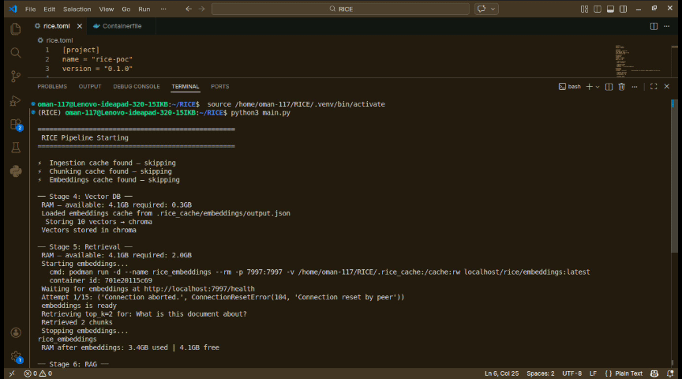

# 🍚 RICE — Declarative LLM/RAG Configuration Engine (v1)

> *"Ricing, but for AI pipelines."*

RICE is an open-source declarative configuration engine that lets you define
complex AI pipelines through a single TOML file — eliminating manual setup,
dependency hell, and configuration overhead.

---
## Demo


---
```toml
# This is all you write. RICE handles the rest.

[ingestion]
source = "./data/"
formats = ["pdf"]

[chunking]
strategy = "recursive"

[embeddings]
model = "BAAI/bge-small-en-v1.5"

[vector_db]
backend = "chroma"

[retrieval]
top_k = 3

[llm]
provider = "local"
model = "llama3.2:3b"
```

---

## The Idea

Think of it like **Linux ricing** — but instead of declaring your window manager,
terminal opacity, and color scheme, you declare your ingestion tool, chunking
strategy, embedding model, and RAG type.

One file. One command. Running pipeline.

```
rice.toml → Parser → Orchestrator → Adapters → Containers → Answer
```

---

## Why RICE?

| Problem | RICE Solution |
|---|---|
| Installing every AI tool locally | Tools run in Podman containers |
| Configuring each tool separately | One TOML file configures everything |
| Dependency conflicts between tools | Each stage container is isolated |
| RAM overload running everything at once | Sequential execution, containers stop after each stage |
| Switching tools requires rewriting code | Change one word in TOML |

---

## Architecture

```
┌─────────────────────────────────────────────┐
│                 rice.toml                   │
│            (user writes this only)          │
└──────────────────┬──────────────────────────┘
                   ↓
┌─────────────────────────────────────────────┐
│                  Parser                     │
│         TOML → dict → Python objects        │
└──────────────────┬──────────────────────────┘
                   ↓
┌─────────────────────────────────────────────┐
│               Orchestrator                  │
│   Runs stages sequentially, manages RAM,    │
│   starts/stops containers, caches to disk   │
└──────────────────┬──────────────────────────┘
                   ↓
┌─────────────────────────────────────────────┐
│                 Adapters                    │
│   Thin HTTP clients — one per stage         │
│   Zero tool knowledge, just HTTP calls      │
└──────────────────┬──────────────────────────┘
                   ↓
┌─────────────────────────────────────────────┐
│            Podman Containers                │
│   Heavy tools run here, isolated            │
│   Released after each stage completes       │
│                                             │
│  ┌──────────────┐  ┌──────────────┐         │
│  │  Ingestion   │  │  Embeddings  │         │
│  │  (Docling)   │  │ (BGE-small)  │         │
│  └──────────────┘  └──────────────┘         │
│  ┌──────────────┐                           │
│  │     LLM      │                           │
│  │   (Ollama)   │                           │
│  └──────────────┘                           │
└─────────────────────────────────────────────┘
```

### RAM Management — Sequential Execution

```
Stage 1: Ingestion container starts  (~2GB)
         → processes documents
         → saves to .rice_cache/
         → container stops, RAM freed

Stage 2: Chunking runs pure Python   (~0.5GB)
         → reads from cache
         → saves chunks to cache

Stage 3: Embeddings container starts (~2GB)
         → generates vectors
         → saves to cache
         → container stops, RAM freed

Stage 4: ChromaDB stores vectors     (~0.3GB)

Stage 5: Ollama generates answer     (~2.5GB)
```

Never more than one heavy container running at a time.

---

## Project Structure

```
rice/
│
├── rice.toml                   ← you write this
├── main.py                     ← entry point
│
├── models.py                   ← config dataclasses
├── parser/parser.py            ← TOML → objects
├── registry/registry.py        ← string → class mappings
│
├── orchestrator/
│   ├── orchestrator.py         ← sequential stage runner
│   └── lifecycle.py            ← container start/stop/health
│
├── adapters/
│   ├── ingestion_adapter.py    ← HTTP → ingestion container
│   ├── chunking_adapter.py     ← pure Python
│   ├── embeddings_adapter.py   ← HTTP → embeddings container
│   ├── vectordb_adapter.py     ← ChromaDB / Qdrant
│   ├── retrieval_adapter.py    ← vector search
│   ├── rag_adapter.py          ← context assembly
│   └── llm_adapter.py          ← HTTP → Ollama / API
│
├── containers/
│   ├── ingestion/              ← Docling + FastAPI dispatcher
│   └── embeddings/             ← sentence-transformers + FastAPI
│
└── .rice_cache/                ← stage outputs (gitignored)
```
## Key Rules
```
1. dimensions must match across embeddings and vector_db
   embeddings.model_params.dimensions = 384
   vector_db.index.dimensions = 384       ← same number

2. max_tokens in chunking must not exceed embeddings max_tokens
   chunking.recursive.target_tokens = 512
   embeddings.model_params.max_tokens = 512  ← same or larger

3. vector_db.sparse.enabled must match embeddings.type
   embeddings.type = "hybrid"
   vector_db.sparse.enabled = true       ← must be true

4. api keys never hardcoded
   api_key = "env:YOUR_KEY_NAME"         ← reads from environment

5. only declare the sub-table matching your strategy
   strategy = "semantic"
   [chunking.semantic]                   ← only this block needed
   # other blocks ignored by orchestrator

6. cache dirs should all be under .rice_cache/
   keeps all runtime data in one place
   easy to clear: rm -rf .rice_cache/
```
---
## Setup

```bash
# clone
git clone https://github.com/YOURUSERNAME/RICE.git
cd RICE

# install local dependencies
pip install requests psutil chromadb

# build stage containers
podman build -t localhost/rice/ingestion:latest  ./containers/ingestion/
podman build -t localhost/rice/embeddings:latest ./containers/embeddings/

# pull and start ollama
podman run -d --name ollama -p 11434:11434 \
  -v ollama_models:/root/.ollama \
  docker.io/ollama/ollama:latest

ollama pull llama3.2:3b
```

---

## Usage

```bash
# 1. drop your documents in data/
cp your-document.pdf ./data/

# 2. configure rice.toml (or use defaults)
nano rice.toml

# 3. run
python3 main.py
```

Output:

```
🍚 RICE Pipeline Starting
── Stage 1: Ingestion ──
✅ Ingested 1 documents
── Stage 2: Chunking ──
✅ Produced 47 chunks
── Stage 3: Embeddings ──
✅ Generated 47 embeddings dim=384
── Stage 4: Vector DB ──
✅ Vectors stored in chroma
── Stage 5: Retrieval ──
✅ Retrieved 3 chunks
── Stage 6: RAG ──
✅ Context assembled
── Stage 7: LLM ──
This document is about...
✅ RICE Pipeline Complete

📚 Sources:
  [1] your-document.pdf score=0.891
```

---

## Switching Tools

The entire point of RICE. Change one word, get different behavior:

```toml
# switch embedding model
model = "BAAI/bge-large-en-v1.5"    # was bge-small

# switch vector db
backend = "qdrant"                    # was chroma

# switch chunking strategy
strategy = "semantic"                 # was recursive

# switch LLM provider
provider = "groq"                     # was local
model = "llama-3.1-8b-instant"
```

Zero code changes. Just TOML.

---

## Roadmap

```
✅ POC — ingestion, chunking, embeddings, vector db, RAG, LLM
⏳ More ingestion tools     (unstructured, marker)
⏳ More chunking strategies (semantic, proposition, RAPTOR)
⏳ Qdrant container         (production vector db)
⏳ Hybrid retrieval         (dense + sparse)
⏳ Reranking                (cross-encoder)
⏳ Inference provider APIs  (OpenRouter, Groq, Together)
⏳ Fine-tuning stage        (Unsloth, Axolotl)
⏳ CLI packaging            (rice run -f rice.toml)
⏳ Community templates      (healthcare, legal, finance)
```

---

## Contributing

RICE is early stage and contributions are welcome. Each new tool
is just a new adapter class + one registry entry. If you add support
for a new vector db, chunking strategy, or ingestion tool open a PR.

---

## License

MIT
